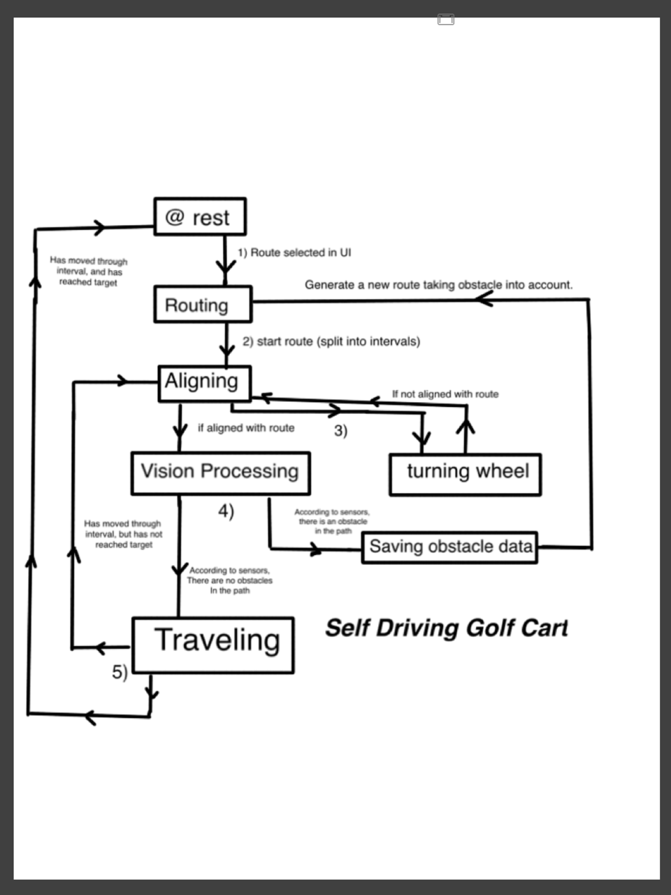

# Self-Driving-Car
E-PAC (Experimental Prototype Autonomous Cart), is an autonomous golf cart built by Aramis Tanelus, Anna Darwish, and J.R. Carneiro with the FRC Team 5472 for the American Heritage School Boca/Delray.

# Finite-State/Flowchart Diagram

# Sponsors:

Lexis Nexis

Sic Inc.

Lenovo.

Sunshine Golfcar

